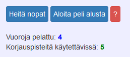
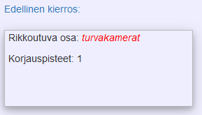
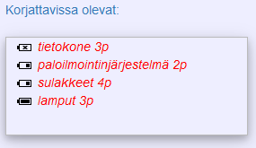

 Pidä integraatio koossa-peli, jonka digitaalisen version tekijä on Mark Laatikainen, on lisensoitu <a rel="license" href="http://creativecommons.org/licenses/by/4.0/">Creative Commons Nimeä 4.0 Kansainvälinen -lisenssillä</a>. Perustuu teokseen osoitteessa <a xmlns:dct="http://purl.org/dc/terms/" href="https://github.com/marklaatikainen/Integraatiopeli" rel="dct:source">https://github.com/marklaatikainen/Integraatiopeli</a>. 

Peli perustuu <a href="https://aikalisa.wordpress.com/">Aikalisän</a> tekemään lautapeliin innovaatiotyönä.

Peliä ja sen sääntöjä ovat olleet ideoimassa Ilari Munukka, Mark Laatikainen, Miikka Kukko ja Jarkko Niemi.
********************
# Pelin ohjeet

Pelissä pelaaja on älykodissa, jossa elektroniikka alkaa mennä rikki. Pelaajan tehtävänä on korjata vikoja parhaansa mukaan. 
Pelaaja voittaa pelin selviämällä kaikki 20 vuoroa, ilman liiallisia vahinkoja.
Alussa pelilaudalla ovat kaikki alueet ehjät ja peli alkaa ensimmäisestä nopan heitosta.
                    
Pelaaja joutuu korjaamaan rikkoutuneet komponentit, pysyäkseen pelissä mukana. Jos pelaaja ei kolmeen vuoroon korjaa rikkinäistä komponenttia, se rikkoutuu korjauskelvottomaksi. Kolmen pisteen komponentit menevät rikki kahdessa vuorossa kolmen sijaan.
                    
Pelaaja voittaa pelin selviämällä 20 vuoroa ilman, että komponentit menevät korjauskelvottomaksi (ovat rikki liian monen vuoron ajan).

    
Pelissä paristoikonit ilmaisevat sen, että kuinka kauan on vielä aikaa korjata kyseinen komponentti ennen pelin häviämistä.

Eriväriset ympyrät ilmaisevat komponentin tilan.
&nbsp;Vihreä on kunnossa, 
&nbsp;keltainen ympyrä ilmaisee komponentin olevan pois käytöstä muun komponentin rikkoutumisen johdosta.
&nbsp;Punainen väri tarkoittaa komponentin olevan rikki ja se on korjattava mahdollisimman nopeasti.

## Komponentit, jotka poistavat muita komponentteja käytöstä

Jos “Sulakkeet” tai “Verkko” menee rikki, vaikuttaa se lukuisiin muihin komponentteihin poistamalla ne käytöstä. Käytöstä poistettu komponentti palaa normaalitilaan, kun sen rikkoutumisellaan käytöstä poistanut komponentti korjataan.

### Tietokone

Jos Tietokone menee rikki, maksaa muiden komponenttien korjaus yhden korjauspisteen enemmän. Muiden komponenttien korjaamiseen vaadittavien korjauspisteiden määrä palaa ennalleen, kun tietokoneen korjaa.
					

Vasemmassa yläkulmassa ovat “Heitä nopat”-, “Aloita peli alusta”-, ja “ohje”-painikkeet.
“Heitä nopat”- painike siirtää pelin seuraavaan vuoroon, ja arpoo sinulle jonkin määrän korjauspisteitä, ja arpoo myös mahdolliset vuorolla rikki menevät komponentit.

Painikkeiden alla olevat numerot kertovat, montako vuoroa olet pelannut (kahdestakymmenestä), ja tällä hetkellä käytettävissä olevien korjauspisteiden kokonaismäärän (viimeksi saadut korjauspisteet + aikaisemmilta vuoroilta säästyneet. Käyttämättömät korjauspisteet säilyvät seuraavalle vuorolle.

“Edellinen kierros”-ruutu kertoo sinulle viime kierroksella rikki menneet komponentit ja viime kierroksella saadut korjauspisteet.

Komponentti korjataan klikkaamalla sen nimeä "Korjattavissa olevat:" laatikosta. Nimen perässä näkyy pistemäärä, jolla komponentti korjataan.

Tässä kyseisessä tilanteessa pelaajan on seuraavalle vuorolle selvitäkseen korjattava tietokone, sillä sen edessä oleva paristoikoni näyttää rastia.
